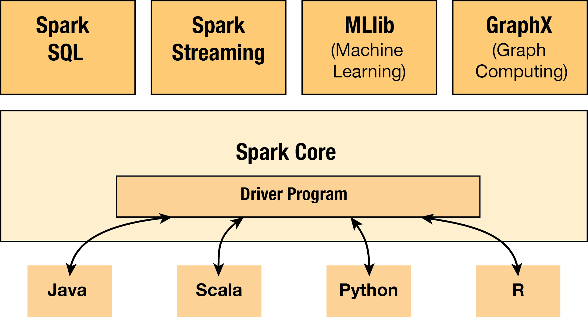

# What is Apache Spark

## History
Apache Spark was first developed in 2009 by AMPLab at UC Berkeley. It was first released at May 30th 2014(only 3 years ago) and later donated to the Apache Software Foundation which has maintained it ever since. 

## Functionalities
It is an open-source, fault-tolerent batch-computing framework similar to Hadoop(We will talk about the difference in next section). It provides us several APIs to manipulate a special kind of datasets(so-called RDD) distributed on many machines in high level and hide away the low-level details to keep operations efficient and fault-tolerent under the hood.

There 1 main component in Spark served as foundation:

- **Spark Core**
  Spark Core provides foundational functionalities like distributed task dispatching, scheduling, basic I/O etc. All these functionalities are exposed through an application programming interface(for Java, Python, Scala, and R) called driver program. We tell the driver program what we want to do by passing a function. And it calls the Spark Core to do the low-level jobs for us.

Built on top of the Spark Core, Spark provide 4 higher-level libraries for special purpose jobs:

- **Spark SQL**
  Spark SQL provides a data abstraction called DataFrames that support both structured or semi-structured data. 

- **Spark Streaming**
  Spark Streaming is used for steaming analysis because of the speed of computation.

- **MLlib**
  MLlib is used for machine learning jobs. Specifically, it includes following machine learning techniques and models:
    - Statistics like correlations, stratified sampling, hypothesis testing, random data generation.
    - Classificationa and Regression like SVM, logistic regression, linear regression, decisoon tree, naive Bayes.
    - Collaborativbe Filtering like alternating least squares
    - Cluster Analysis like kmeans and Latent Dirichlet Allocation
    - Dimension Reduction like SVD and PCA
    - Feature Extraction and Transformation
    - Optimization like SGD, L-BFGS.

- **GraphX**
  GraphX is used for graph processing like PageRank and so on.

# What is special about Spark
All we do with data can be generalized as applying some operations on some dataset. Spark is designed in this way too.

## RDD
The special kind of datasets in Spark--**Resilient Distributed Datasets(RDDs)**--form the foundation of Spark. Basically, an RDD is a collections of tuples. What is special about RDD is that your can keep it in memories of machines by using ``persist()`` or ``cache()`` method. On addition to that, you can specify the storage level to control how it is saved. 

By default, Spark saves the RDD as deserialized Java objects in memory. And if the RDD is too big, the part that doesn't fit will not be cached and will be recompute on the fly every time they are needed. (For the full set of storage levels and their details, check -> https://spark.apache.org/docs/latest/rdd-programming-guide.html#rdd-persistence)

This is the key difference between Spark and Hadoop. Because as we know, Hadoop don't save any output in memory, even the intermediate key/value pairs coming out of map function are saved to local disk and being retrieved by reducer. The disk I/Os and serialization/deserialization during I/O make the process very inefficient if we need to use the same dataset from time to time. (Think about tuning models in Machine Learning.) **In contrast, the RDDs used in Spark can stay in memory thus allows up to use them iteratively and interactively over and over again without having to read them from disk. **

## Operations:
The operations to manipulate RDD in Spark are highlevel and flexible. They are high-level because it saves us from disk I/Os and provide a varity of high-level operations like JCascalog and other libraries for Hadoop. They are flexible because lots of the operations work with customed functions implemented for specific purpose by ourselves. In general, the operations are categorized into transformations and actions:

- **Transformations: all the operations take in RDD and return a new RDD are considered transformations.** Below are some of them:

    | Transformation | Meaning |
    | --- | --- |
    | map(function) | use the input function to process each row of RDD and return a new processed RDD|
    | filter(function) | use the input function to evaluate each row of RDD and remove the rows evaluated false |
    | union(otherDataset) | return the union of 2 data sets based on identical fields |
    | reduceByKey(function, [numTasks]) | return a new RDD in which values of same key are aggregated |
    | ... | ...|

- **Actions: all the operations take in RDD and return something that is not RDD are considered actions.** For example:

    | Actions | Meaning |
    | --- | --- |
    | reduce(function) | aggregate the elements of RDD using provided function|
    | collect() | return all the elements in RDD as an array |
    | rake(n) | return the elements of first n rows in RDD as an array |
    | saveAsSequenceFile(path) | wite the elements of the dataset as a Hadoop SequenceFile in a given path in local filesystem |
    | ... | ...|

For more operations and details, check -> https://spark.apache.org/docs/latest/rdd-programming-guide.html#transformations

On addition to these basic, one-step type of operations, Spark offers more complex operations in those 4 specific purpose libraries we talked about in last section. And these complex operations are nothing more than a combination of basic operations.

# When should we use it
As we said, the main advantage of Spark is the RDD. It's fast for iterative algorithm and interactive developing environment. And it's convinient to use those 4 specific purpose libraries if they suit our needs.

# References
Apache Spark Documentation: (https://spark.apache.org/docs/latest/index.html)
Wikipedia: Apache Spark: (https://en.wikipedia.org/wiki/Apache_Spark)
Apache Spark GitHub Repository: (https://github.com/apache/spark)

